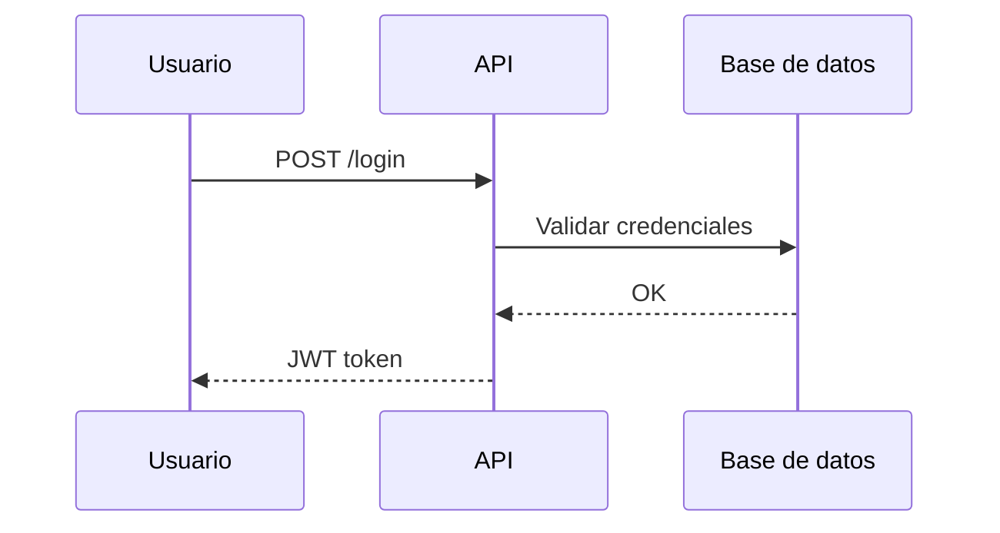

# Diagramas con Draw.io MCP

## Objetivo

Crear diagramas de arquitectura, flujos, organigramas y visualizaciones usando el MCP oficial de Draw.io (`drawio-mcp`).

## Herramientas disponibles

El MCP `drawio-mcp` expone tres herramientas. Usa la más adecuada según el tipo de diagrama:

| Herramienta | Uso | Formato |
|-------------|-----|---------|
| `open_drawio_mermaid` | Diagramas de secuencia, flujos, ER, arquitectura | Sintaxis Mermaid.js |
| `open_drawio_csv` | Organigramas, jerarquías, tablas convertidas a diagrama | CSV |
| `open_drawio_xml` | Diagramas nativos draw.io/mxGraph (máximo control) | XML draw.io |

## Cuándo usar cada herramienta

- **Mermaid**: Flujos, secuencias, arquitectura de componentes, diagramas ER. Es la opción más rápida y legible.
- **CSV**: Organigramas (CEO → CTO, CFO; CTO → 3 Engineers), jerarquías tabulares.
- **XML**: Cuando necesites estilos específicos o diagramas muy detallados en formato nativo.

## Instrucciones

1. **Antes de llamar al MCP**: Lee el esquema del tool en `mcps/` para ver parámetros exactos.
2. **Genera el contenido** en el formato adecuado (Mermaid, CSV o XML).
3. **Llama** `call_mcp_tool` con `server: "drawio-mcp"` (o el nombre configurado) y el tool correspondiente.
4. **Entrega al usuario** la URL que devuelve el MCP para que abra el diagrama en draw.io.

## Parámetros comunes

- `content` (string, requerido): Contenido del diagrama.
- `lightbox` (boolean, opcional): Modo solo lectura (default: false).
- `dark` (string, opcional): "auto", "true" o "false" (default: "auto").

## Ejemplo Mermaid (diagrama de secuencia)



## Ejemplo CSV (organigrama)

```csv
Nombre,Rol,Reporta a
CEO,Director Ejecutivo,
CTO,Director Técnico,CEO
CFO,Director Financiero,CEO
Eng1,Ingeniero,CTO
Eng2,Ingeniero,CTO
```

## Restricciones

- Requiere Node.js (v20+) y `npx` para ejecutar el MCP.
- El MCP debe estar configurado en `~/.cursor/mcp.json` como `drawio-mcp`.
- Si el usuario pide guardar el diagrama como archivo `.drawio`, indica que puede exportar desde draw.io (File → Export as → .drawio) tras abrir la URL.
