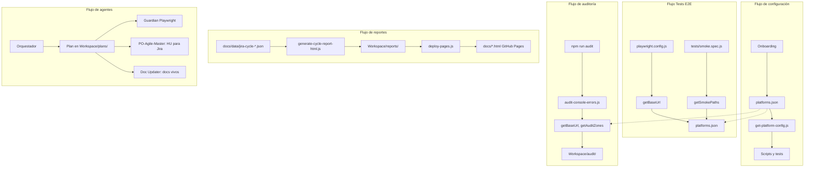

# Estructura del Proyecto prueba-agente-po

> Documento de referencia para entender la organización del código y la lógica del proyecto.

---

## Árbol de directorios

```
prueba-agente-po/
├── .cursor/                    # Configuración de agentes Cursor (ver .cursor/README.md)
│   ├── rules/                  # Reglas Cursor (orquestador, onboarding, guardian)
│   │   ├── 00-swarm-orchestrator.mdc   # Orquestador (siempre activa)
│   │   ├── 01-plans-location.mdc       # Planes en Workspace/plans/
│   │   ├── 02-onboarding-first-interaction.mdc
│   │   ├── agent-tech-guardian.mdc     # QA/Playwright (globs: tests)
│   │   ├── agent-github-repos.mdc      # Lectura repos GitHub de la plataforma
│   │   ├── agent-po-agile-master.mdc   # PO: Historias de Usuario para Jira (INVEST)
│   │   └── agent-doc-updater.mdc       # Experto en documentación (globs: código, docs)
│   ├── skills/                 # Skills especializados
│   │   ├── construir/         # Build y deploy
│   │   └── prueba/            # Tests E2E y validación UI
│   └── plans/                  # Redirige a Workspace/plans/
│
├── docs/                       # Documentación y reportes publicados
│   ├── architecture/           # Diseño del sistema
│   ├── onboarding/             # Flujo primera interacción
│   ├── runbook/                # Guías operativas
│   ├── decisions/              # ADRs
│   ├── testing/                # Docs de testing (vitest-cli.md)
│   ├── analisis/               # Análisis en Markdown
│   ├── templates/              # Plantillas (platforms.example.json)
│   ├── Asset/                  # CSS/HTML para reportes
│   ├── data/                   # Datos de referencia (jira-cycle-*.json)
│   └── *.html                  # Reportes publicados (GitHub Pages)
│
├── miniverse/                  # Mundo de píxeles para agentes IA (ver docs/architecture/1-stack.md)
│   ├── src/                    # Frontend (Vite) + servidor (Express)
│   ├── public/                 # world.json, assets
│   └── .claude/                # Hooks Claude Code
├── rules/                      # Reglas técnicas (Playwright, Datadog, PRD)
├── scripts/                    # Scripts de auditoría y config
│   ├── get-platform-config.js  # Lee platforms.json; usado por Playwright y audit
│   ├── audit-console-errors.js # Auditoría de consola (URL y zonas desde config)
│   └── audit-data.js           # Helpers para auditoría
│
├── .githooks/                  # Git hooks (pre-commit: recordatorio Doc Updater)
│   ├── pre-commit              # Recordatorio cuando hay código sin docs
│   └── README.md               # Instalación: git config core.hooksPath .githooks
│
├── tests/
│   ├── smoke.spec.js           # E2E agnósticos (baseURL y smokePaths desde config)
│   └── unit/                   # Tests unitarios Vitest
│
├── tools/scripts/              # Scripts de reportes y deploy
│   ├── generate-cycle-report-html.js
│   ├── analyze-cycle-time.js
│   ├── deploy-pages.js
│   └── README.md
│
├── Workspace/                  # Artefactos generados (.gitignore)
│   ├── config/                 # platforms.json (creado en onboarding)
│   ├── reports/                # HTML, MD de reportes
│   ├── audit/                  # Auditoría consola (JSON, screenshots)
│   ├── playwright/             # test-results, playwright-report
│   ├── plans/                  # Planes generados por agentes
│   ├── observabilidad/         # Runbooks Datadog, mapeos
│   ├── repos/                  # Repos externos clonados
│   └── data/                   # Datos exportados (opcional)
│
├── playwright.config.js        # baseURL desde get-platform-config
├── vitest.config.js
├── package.json
└── .cursorrules                # Reglas raíz (lee docs/resumen-proyecto.md)
```

---

## Lógica del proyecto

### Flujo de configuración

1. **Onboarding**: Si no existe `Workspace/config/platforms.json`, seguir `docs/onboarding/01-flujo-primera-interaccion.md`.
2. **Config central**: `platforms.json` define URLs, smokePaths, auditZones, Jira y Datadog por plataforma.
3. **Scripts y tests** leen la config vía `scripts/get-platform-config.js`.

### Flujo de tests E2E

```
playwright.config.js → getBaseUrl() → platforms.json
tests/smoke.spec.js  → getSmokePaths() → platforms.json
```

### Flujo de auditoría

```
npm run audit → audit-console-errors.js → getBaseUrl(), getAuditZones()
             → Workspace/audit/ (JSON, screenshots)
```

### Flujo de reportes

```
docs/data/jira-cycle-*.json → generate-cycle-report-html.js → Workspace/reports/
                           → deploy-pages.js → docs/*.html (GitHub Pages)
```

### Flujo de agentes

```
Orquestador (00-swarm-orchestrator) → Plan en Workspace/plans/
                                    → Validación Playwright (agent-tech-guardian)
                                    → Lectura repos plataforma (agent-github-repos)
                                    → Historias de Usuario para Jira (agent-po-agile-master)
                                    → Documentación viva (agent-doc-updater, pre-commit)
```

### Diagrama de flujos (vista integrada)



> **[Abrir en Draw.io](diagrams/flujo-estructura.html)** — Editar diagrama en la aplicación

📄 **Documento visual para negocio:** [architecture/5-agents-functional-architecture.md](./architecture/5-agents-functional-architecture.md)

---

## Separación código vs artefactos

| Ubicación | Versionado | Contenido |
|-----------|------------|-----------|
| `tests/`, `scripts/`, `tools/`, `docs/` (excepto reportes generados) | Sí | Código fuente y documentación |
| `Workspace/` | No (.gitignore) | Resultados de agentes, config, reportes, audit |
| `docs/*.html` (reportes) | Sí | Publicados por `deploy:pages` para GitHub Pages |

---

## Referencias

- [resumen-proyecto.md](./resumen-proyecto.md) — Contexto principal para IA
- [architecture/4-workspace.md](./architecture/4-workspace.md) — Detalle del Workspace
- [onboarding/01-flujo-primera-interaccion.md](./onboarding/01-flujo-primera-interaccion.md) — Primera interacción
