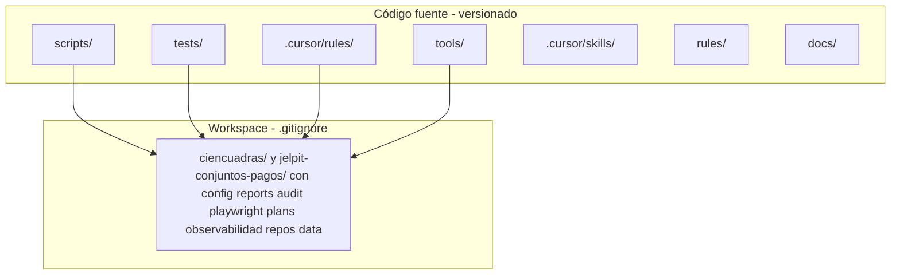

# Arquitectura - Resumen General

## Visión

**prueba-agente-po** es un workspace **agnóstico** de pruebas E2E y auditoría para cualquier plataforma. La configuración por producto (URLs, Jira, Datadog) vive en `Workspace/ciencuadras/config/platforms.json` por defecto (u otro `WORKSPACE_ROOT`; ver [4-workspace](./4-workspace.md)).

## Equipo de agentes (resumen ejecutivo)

Un conjunto de agentes de IA coordina el ciclo de desarrollo en **4 fases**: Análisis (Scout + Jira) → Contexto (Historian + código) → Planificación → Validación (Guardian + Playwright). El **Orquestador** activa a cada especialista con la herramienta **Task** (subagentes), según `.cursor/rules/00-swarm-orchestrator.mdc`.

📄 **Para explicar a negocio:** [5-agents-functional-architecture.md](./5-agents-functional-architecture.md) — diagramas visuales y lenguaje sencillo.

## Estado actual del código

| Componente | Estado | Notas |
|------------|--------|-------|
| `tests/smoke.spec.js` | ✅ | E2E smoke (baseURL y smokePaths desde platforms.json) |
| `tests/reportes.spec.js` | ✅ | E2E de `reportes.html` (GitHub Pages); URL por `REPORTES_BASE_URL` |
| `tests/miniverse.spec.js` | ✅ | E2E Miniverse (`npx playwright test --project=miniverse`) |
| `tests/unit/*.test.js` | ✅ | Vitest: audit-data, get-platform-config, analyze-cycle-time, etc. |
| `scripts/audit-console-errors.js` | ✅ | Auditoría de consola (URL y zonas desde config) |
| `scripts/audit-lighthouse.js` | ✅ | Auditoría rendimiento → `Workspace/audit/lighthouse/` |
| `scripts/workspace-root.js` | ✅ | Resuelve `WORKSPACE_ROOT` → artefactos bajo `Workspace/<producto>/` |
| `scripts/get-platform-config.js` | ✅ | Lee platforms.json del workspace activo; usado por Playwright, audit y scripts |
| `scripts/demo-agentes-run.js` | ✅ | Demo agentes + `docs/demo-agentes.html` |
| `tools/scripts/generate-cycle-report-html.js` | ✅ | Reporte ciclo de desarrollo |
| `tools/scripts/analyze-cycle-time.js` | ✅ | Análisis tiempo por fase (Jira) → MD en Workspace/reports/ |
| `tools/scripts/deploy-pages.js` | ✅ | Regenera reportes y copia a docs/ para GitHub Pages |
| `tools/scripts/create-cursor-automation.js` | ✅ | Automation Datadog→Cursor (`npm run automation:create-cursor`) |
| `tools/scripts/regenerate-diagram-html.js` | ✅ | HTML de diagramas desde `.mmd` (`npm run diagrams:regenerate-html`) |
| `miniverse/` | ✅ | Mundo de píxeles para agentes IA; stack en [1-stack.md](./1-stack.md) |
| `Workspace/ciencuadras/config/platforms.json` | ⚙️ | Config por plataforma por defecto (crear en onboarding; no versionado) |

## Tests E2E (implementados)

- **Playwright**: `playwright.config.js` — proyecto **chromium** (smoke + reportes; excluye `miniverse.spec.js` y `tests/unit/**`); proyecto **miniverse** solo `miniverse.spec.js`
- **Smoke**: `tests/smoke.spec.js` — baseURL y `smokePaths` desde el `config/platforms.json` del workspace activo
- **Reportes**: `tests/reportes.spec.js` — comprobaciones de `reportes.html` publicado (variable `REPORTES_BASE_URL`)

## Separación código vs artefactos

El proyecto separa estrictamente el código fuente (versionado) de los artefactos generados (`.gitignore`):

> **[Abrir en Draw.io](../diagrams/codigo-vs-artefactos.html)** — Editar diagrama en la aplicación

Ver [4-workspace.md](./4-workspace.md) para detalles.

## Documentos relacionados

- [../ESTRUCTURA.md](../ESTRUCTURA.md) — Estructura completa y flujos de lógica
- [1-stack.md](./1-stack.md) — Tecnologías y versiones
- [4-workspace.md](./4-workspace.md) — Estructura del Workspace (resultados de agentes)
- [5-agents-functional-architecture.md](./5-agents-functional-architecture.md) — Arquitectura funcional de agentes (visual, para negocio)
