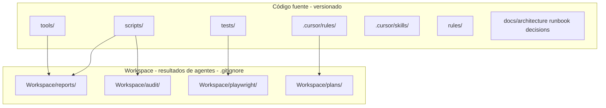

# Arquitectura - Resumen General

## Visión

**prueba-agente-po** es un workspace **agnóstico** de pruebas E2E y auditoría para cualquier plataforma. La configuración por producto (URLs, Jira, Datadog) vive en `Workspace/config/platforms.json`.

## Estado actual del código

| Componente | Estado | Notas |
|------------|--------|-------|
| `tests/ciencuadras.spec.js` | ✅ | E2E (baseURL configurable) |
| `scripts/audit-console-errors.js` | ✅ | Auditoría de consola |
| `tools/scripts/generate-cycle-report-html.js` | ✅ | Reporte ciclo de desarrollo |
| `tools/scripts/deploy-pages.js` | ✅ | Publicación a GitHub Pages |
| `Workspace/config/platforms.json` | ⚙️ | Config por plataforma (onboarding) |

## Tests E2E (implementados)

- **Playwright**: `tests/ciencuadras.spec.js` — smoke tests contra la URL en `playwright.config.js` o `Workspace/config/platforms.json`
- **Config**: `playwright.config.js` — baseURL configurable por plataforma

## Separación código vs artefactos

El proyecto separa estrictamente el código fuente (versionado) de los artefactos generados (`.gitignore`):

Ver [4-workspace.md](./4-workspace.md) para detalles.

## Documentos relacionados

- [1-stack.md](./1-stack.md) — Tecnologías y versiones
- [4-workspace.md](./4-workspace.md) — Estructura del Workspace (resultados de agentes)
