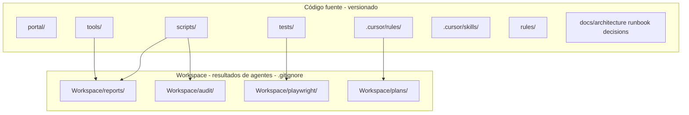

# Arquitectura - Resumen General

## Visión

**prueba-agente-po** es un workspace que integra:

1. **AgentCrew** — Orquestador de agentes IA. El servidor arranca con estructura modular; webhooks operativos, NATS/agents/schedules como stubs.
2. **Ecosistema Ciencuadras** — Tests E2E y auditoría del portal inmobiliario ciencuadras.com

## Estado actual del código

| Componente | Estado | Notas |
|------------|--------|-------|
| `portal/server/index.js` | ✅ | Punto de entrada; bootstrap con NATS, schedules, agents |
| `portal/server/app.js` | ✅ | Express: health, info, registro de webhooks |
| `portal/server/triggers/webhooks.js` | ✅ | Rutas POST /webhook y POST /webhook/:jobId |
| `portal/server/triggers/schedules.js` | 🔶 Stub | No-op; cron por implementar |
| `portal/server/config/nats.js` | 🔶 Stub | Mock local; conexión NATS real por implementar |
| `portal/server/agents/claude-provider.js` | 🔶 Stub | No-op; por implementar |
| `portal/server/agents/opencode-provider.js` | 🔶 Stub | No-op; por implementar |
| `portal/server/post-actions/` | ❌ | No existe |
| `tests/ciencuadras.spec.js` | ✅ | E2E contra ciencuadras.com |
| `scripts/audit-console-errors.js` | ✅ | Auditoría de consola |
| `tools/scripts/seed-webhook-jobs.js` | ✅ | Inyecta jobs vía POST; requiere API en ejecución |
| `tools/scripts/trigger-webhook-cli.js` | ✅ | CLI para disparar webhooks manualmente |

## Flujo de datos (AgentCrew — diseño objetivo)

```
┌─────────────┐     ┌─────────────┐     ┌─────────────┐
│  Triggers   │────▶│    NATS     │────▶│   Agents    │
│ Schedules   │     │  Pub/Sub    │     │ Claude      │
│ Webhooks    │     │             │     │ OpenCode    │
└─────────────┘     └─────────────┘     └──────┬──────┘
                                               │
                                               ▼
                                        ┌─────────────┐
                                        │ Post-Actions│
                                        │ Slack, API  │
                                        └─────────────┘
```

> **Estado**: Webhooks responden HTTP; NATS, agents y post-actions son stubs. El flujo completo está por implementar.

## Tests E2E (implementados)

- **Playwright**: `tests/ciencuadras.spec.js` — smoke tests contra `https://www.ciencuadras.com`
- **Config**: `playwright.config.js` — baseURL: ciencuadras.com, proyecto chromium

## Separación código vs artefactos

El proyecto separa estrictamente el código fuente (versionado) de los artefactos generados (`.gitignore`):



Ver [4-workspace.md](./4-workspace.md) para detalles.

## Documentos relacionados

- [1-stack.md](./1-stack.md) — Tecnologías y versiones
- [2-data-modeling.md](./2-data-modeling.md) — Modelos y mensajes (diseño AgentCrew)
- [3-routes.md](./3-routes.md) — Rutas y APIs (diseño AgentCrew)
- [4-workspace.md](./4-workspace.md) — Estructura del Workspace (resultados de agentes)
