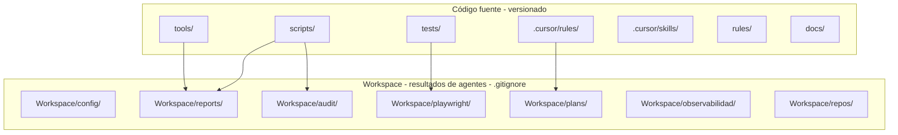

# Arquitectura - Resumen General

## Visión

**prueba-agente-po** es un workspace **agnóstico** de pruebas E2E y auditoría para cualquier plataforma. La configuración por producto (URLs, Jira, Datadog) vive en `Workspace/config/platforms.json`.

## Equipo de agentes (resumen ejecutivo)

Un conjunto de agentes de IA coordina el ciclo de desarrollo en **4 fases**: Análisis (Scout + Jira) → Contexto (Historian + código) → Planificación → Validación (Guardian + Playwright).

📄 **Para explicar a negocio:** [5-agents-functional-architecture.md](./5-agents-functional-architecture.md) — diagramas visuales y lenguaje sencillo.

## Estado actual del código

| Componente | Estado | Notas |
|------------|--------|-------|
| `tests/smoke.spec.js` | ✅ | E2E agnósticos (baseURL y smokePaths desde platforms.json) |
| `tests/unit/audit.test.js` | ✅ | Tests unitarios Vitest (audit-data) |
| `scripts/audit-console-errors.js` | ✅ | Auditoría de consola (URL y zonas desde config) |
| `scripts/get-platform-config.js` | ✅ | Lee platforms.json; usado por Playwright, audit y scripts |
| `tools/scripts/generate-cycle-report-html.js` | ✅ | Reporte ciclo de desarrollo |
| `tools/scripts/analyze-cycle-time.js` | ✅ | Análisis tiempo por fase (Jira) → MD en Workspace/reports/ |
| `tools/scripts/deploy-pages.js` | ✅ | Regenera reportes y copia a docs/ para GitHub Pages |
| `miniverse/` | ✅ | Mundo de píxeles para agentes IA; stack en [1-stack.md](./1-stack.md) |
| `tests/miniverse.spec.js` | ✅ | E2E Miniverse (`--project=miniverse`) |
| `Workspace/config/platforms.json` | ⚙️ | Config por plataforma (crear en onboarding) |

## Tests E2E (implementados)

- **Playwright**: `tests/smoke.spec.js` — smoke tests agnósticos; baseURL y rutas desde `Workspace/config/platforms.json`
- **Config**: `playwright.config.js` — baseURL configurable por plataforma

## Separación código vs artefactos

El proyecto separa estrictamente el código fuente (versionado) de los artefactos generados (`.gitignore`):

> **[Abrir en Draw.io](../diagrams/codigo-vs-artefactos.html)** — Editar diagrama en la aplicación

Ver [4-workspace.md](./4-workspace.md) para detalles.

## Documentos relacionados

- [../ESTRUCTURA.md](../ESTRUCTURA.md) — Estructura completa y flujos de lógica
- [1-stack.md](./1-stack.md) — Tecnologías y versiones
- [4-workspace.md](./4-workspace.md) — Estructura del Workspace (resultados de agentes)
- [5-agents-functional-architecture.md](./5-agents-functional-architecture.md) — Arquitectura funcional de agentes (visual, para negocio)
