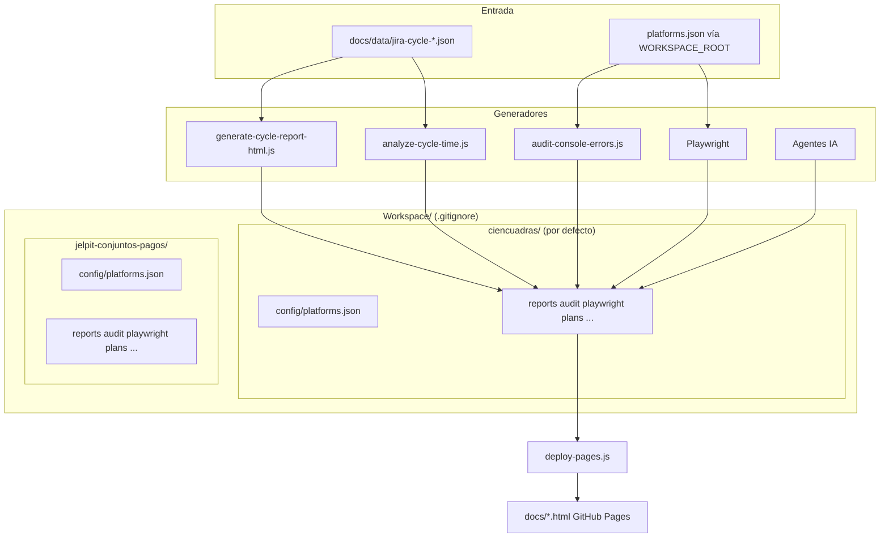

# Workspace: resultados del trabajo de agentes

Workspace almacena los resultados del trabajo de cada agente (scripts, tests, agentes IA). Esta carpeta está en `.gitignore` para mantener la separación estricta entre código fuente y artefactos generados.

## Diagrama: flujo de datos y generadores



> **[Abrir en Draw.io](../diagrams/flujo-workspace.html)** — Editar diagrama en la aplicación

## Estructura

En la raíz de `Workspace/` solo viven **dos árboles por producto**. Cada uno incluye la misma forma de carpetas:

```
Workspace/
├── ciencuadras/                 # Producto por defecto (WORKSPACE_ROOT sin definir)
│   ├── config/platforms.json    # Varias plataformas en un solo JSON (Ciencuadras + Jelpit, etc.)
│   ├── reports/
│   ├── audit/
│   ├── observabilidad/
│   ├── repos/
│   ├── playwright/
│   ├── plans/
│   └── data/
└── jelpit-conjuntos-pagos/
    ├── config/platforms.json    # Solo Jelpit (o copia afinada)
    ├── reports/
    ├── audit/
    ├── observabilidad/
    ├── repos/
    ├── playwright/
    ├── plans/
    └── data/
```

## Workspaces por producto (Ciencuadras / Jelpit)

| Carpeta | Producto |
|---------|----------|
| `Workspace/ciencuadras/` | Ciencuadras (artefactos históricos y **raíz por defecto**) |
| `Workspace/jelpit-conjuntos-pagos/` | Jelpit Conjuntos & Jelpit Pagos |

Variable de entorno (desde la raíz del repo):

```bash
export WORKSPACE_ROOT=Workspace/ciencuadras
# o
export WORKSPACE_ROOT=Workspace/jelpit-conjuntos-pagos
```

Los scripts resuelven rutas con `scripts/workspace-root.js`. **Si no defines `WORKSPACE_ROOT`, la raíz es `Workspace/ciencuadras/`** (config en `Workspace/ciencuadras/config/platforms.json`).

## Configuración de plataformas

`Workspace/ciencuadras/config/platforms.json` (o el `config/platforms.json` del `WORKSPACE_ROOT` activo) contiene la configuración por plataforma:

- **URLs**: app, staging, docs
- **smokePaths**: rutas para tests E2E (`tests/smoke.spec.js`)
- **auditZones**: zonas para auditoría de consola (name, url)
- **Jira**: projectKey, projectUrl, tablero de incidentes, tablero de incidentes de seguridad
- **Datadog**: site, dashboardIds, monitorTags

Se crea en la **primera interacción** siguiendo `docs/onboarding/01-flujo-primera-interaccion.md`. Plantilla: `docs/templates/platforms.example.json`.

## Subcarpetas

| Carpeta | Generador | Contenido |
|---------|-----------|-----------|
| `reports/` | `tools/scripts/generate-cycle-report-html.js`, `tools/scripts/analyze-cycle-time.js` | `analisis-ciclo-desarrollo.html`, `analisis-ciclo-desarrollo.md` |
| `audit/` | `scripts/audit-console-errors.js`, `scripts/audit-lighthouse.js` | `console-audit-report.json`, `screenshots/`, `lighthouse/` |
| `playwright/` | Playwright, `tools/scripts/create-cursor-automation.js` | `test-results/`, `playwright-report/`, `cursor-browser-state/` |
| `plans/` | Agentes IA (Cursor) | Planes generados por el orquestador |
| `observabilidad/` | Análisis Datadog | Runbooks, mapeo servicio↔repo |
| `repos/` | Clonación manual | Repos externos de la plataforma |
| `data/` | Opcional | Datos exportados |

## Publicación en GitHub Pages

Los reportes HTML en `{WORKSPACE_ROOT}/reports/` no se publican automáticamente porque `Workspace/` está en `.gitignore`. Para publicar:

```bash
npm run deploy:pages
```

Este comando regenera los reportes y los copia a `docs/` para que GitHub Pages los sirva. Luego hacer commit y push.

## Datos de entrada

Los scripts de reportes leen datos de `docs/data/` (ej. `jira-cycle-2025.json`). Esos archivos son datos de referencia versionados y no se consideran artefactos.

## Screenshots de auditoría

Las capturas de auditoría están en `{WORKSPACE_ROOT}/audit/screenshots/`. Al ejecutar `npm run deploy:pages`, se copian a `docs/screenshots-auditoria/` para publicación en GitHub Pages.
