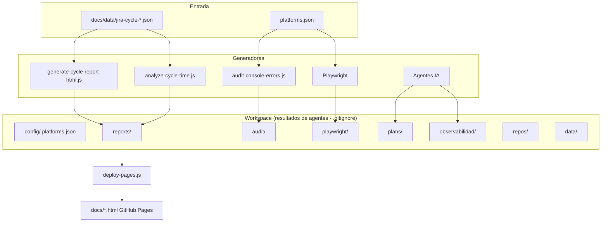

# Workspace: resultados del trabajo de agentes

Workspace almacena los resultados del trabajo de cada agente (scripts, tests, agentes IA). Esta carpeta está en `.gitignore` para mantener la separación estricta entre código fuente y artefactos generados.

## Diagrama: flujo de datos y generadores



> **[Abrir en Draw.io](../diagrams/flujo-workspace.html)** — Editar diagrama en la aplicación

## Estructura

```
Workspace/
├── config/         # Configuración por plataforma (URLs, Jira, Datadog)
│   └── platforms.json   # Creado en onboarding; plantilla en docs/templates/
├── reports/        # Reportes HTML y MD (análisis ciclo, auditoría, etc.)
├── audit/          # Auditoría de consola (JSON, screenshots)
├── observabilidad/ # Documentación de observabilidad (runbooks, mapeos)
├── repos/          # Repos externos clonados de la plataforma
├── playwright/     # test-results, playwright-report
├── plans/          # Planes generados por agentes
└── data/           # Datos exportados (opcional)
```

## Configuración de plataformas

`Workspace/config/platforms.json` contiene la configuración específica por producto:

- **URLs**: app, staging, docs
- **smokePaths**: rutas para tests E2E (`tests/smoke.spec.js`)
- **auditZones**: zonas para auditoría de consola (name, url)
- **Jira**: projectKey, projectUrl, tablero de incidentes, tablero de incidentes de seguridad
- **Datadog**: site, dashboardIds, monitorTags

Se crea en la **primera interacción** siguiendo `docs/onboarding/01-flujo-primera-interaccion.md`. Plantilla: `docs/templates/platforms.example.json`.

## Subcarpetas

| Carpeta | Generador | Contenido |
|---------|-----------|-----------|
| `reports/` | `tools/scripts/generate-cycle-report-html.js`, `tools/scripts/analyze-cycle-time.js` | `analisis-ciclo-desarrollo.html`, `analisis-ciclo-desarrollo.md` |
| `audit/` | `scripts/audit-console-errors.js` | `console-audit-report.json`, `screenshots/` |
| `playwright/` | Playwright | `test-results/`, `playwright-report/` |
| `plans/` | Agentes IA (Cursor) | Planes generados por el orquestador |
| `observabilidad/` | Análisis Datadog | Runbooks, mapeo servicio↔repo |
| `repos/` | Clonación manual | Repos externos de la plataforma |
| `data/` | Opcional | Datos exportados |

## Publicación en GitHub Pages

Los reportes HTML en `Workspace/reports/` no se publican automáticamente porque `Workspace/` está en `.gitignore`. Para publicar:

```bash
npm run deploy:pages
```

Este comando regenera los reportes y los copia a `docs/` para que GitHub Pages los sirva. Luego hacer commit y push.

## Datos de entrada

Los scripts de reportes leen datos de `docs/data/` (ej. `jira-cycle-2025.json`). Esos archivos son datos de referencia versionados y no se consideran artefactos.

## Screenshots de auditoría

Las capturas de auditoría están en `Workspace/audit/screenshots/`. Al ejecutar `npm run deploy:pages`, se copian a `docs/screenshots-auditoria/` para publicación en GitHub Pages.
