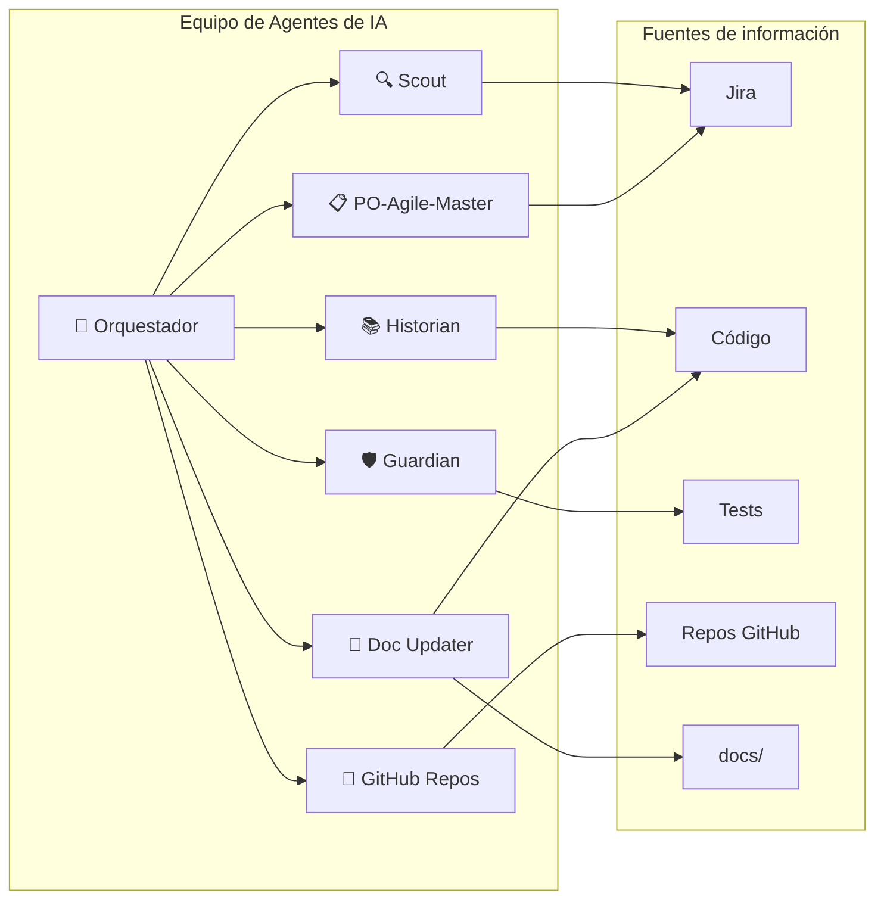

# Arquitectura Funcional de Agentes

> **Documento para negocio:** Explica cómo trabajan los agentes de IA en el proyecto y qué valor aportan.

---

## ¿Qué problema resolvemos?

Las tareas de desarrollo suelen requerir **muchos pasos manuales**: leer tickets en Jira, revisar el código, planificar cambios, validar que todo funcione. Esto consume tiempo y puede generar errores por falta de contexto.

**Los agentes automatizan y coordinan** estas fases, reduciendo tiempo y aumentando la trazabilidad entre negocio (Jira) y calidad (tests).

---

## El equipo de agentes en una imagen



> **[Abrir en Draw.io](../diagrams/equipo-agentes.html)** — Editar diagrama en la aplicación

| Agente | Rol en lenguaje simple | ¿Qué hace? |
|--------|------------------------|-------------|
| **🎯 Orquestador** | El coordinador | Decide el orden de trabajo y asegura que cada fase se complete antes de pasar a la siguiente |
| **🔍 Scout** | El explorador | Lee los tickets de Jira y extrae qué se necesita hacer (requerimientos) |
| **📚 Historian** | El experto en historia | Revisa el código y los cambios recientes para evitar repetir errores del pasado |
| **🛡️ Guardian** | El validador | Ejecuta pruebas automáticas y solo da por terminada la tarea cuando todo pasa |
| **📂 GitHub Repos** | El lector de repos | Lee repositorios externos de la plataforma (PRs, archivos, commits) vía MCP GitHub |
| **📋 PO-Agile-Master** | El Product Owner | Transforma requisitos en Historias de Usuario listas para Jira (formato INVEST, criterios Dado-Cuando-Entonces) |
| **📝 Doc Updater** | El documentador | Actualiza la documentación cuando el código cambia con una solución definitiva (se activa en pre-commit) |

---

## Flujo completo: de la idea al resultado validado

```mermaid
flowchart TB
    subgraph entrada [Entrada]
        U[👤 Usuario: "Necesito implementar X"]
    end

    subgraph fases [4 Fases del Protocolo]
        F1[1️⃣ ANÁLISIS<br/>Scout lee Jira]
        F2[2️⃣ CONTEXTO<br/>Historian revisa código]
        F3[3️⃣ PLANIFICACIÓN<br/>Plan en Workspace/plans/]
        F4[4️⃣ VALIDACIÓN<br/>Guardian ejecuta Playwright]
    end

    subgraph salida [Salida]
        R[✅ Tarea completada con reporte de éxito]
    end

    U --> F1
    F1 --> F2
    F2 --> F3
    F3 --> F4
    F4 --> R
```

> **[Abrir en Draw.io](../diagrams/4-fases-protocolo.html)** — Editar diagrama en la aplicación

---

## Detalle por fase (para explicar en reuniones)

### 1️⃣ Fase de Análisis — Scout

**Pregunta que responde:** *¿Qué quiere el negocio?*

- Conecta con **Jira** (gestión de proyectos)
- Lee el ticket asignado
- Extrae los requerimientos en lenguaje claro

**Valor para negocio:** Trazabilidad directa entre lo que pide Jira y lo que se implementa.

---

### 2️⃣ Fase de Contexto — Historian

**Pregunta que responde:** *¿Qué impacto tendrá este cambio?*

- Revisa el **código actual** del proyecto
- Analiza **cambios recientes** (PRs, commits)
- Identifica riesgos y dependencias

**Valor para negocio:** Menos errores por falta de contexto; decisiones más informadas.

---

### 3️⃣ Fase de Planificación

**Pregunta que responde:** *¿Cómo lo haremos paso a paso?*

- Genera un **plan escrito** antes de tocar código
- Se guarda en `Workspace/plans/`
- Permite revisar la estrategia antes de ejecutar

**Valor para negocio:** Transparencia y posibilidad de ajustar el enfoque antes de invertir tiempo en desarrollo.

---

### 4️⃣ Fase de Validación — Guardian

**Pregunta que responde:** *¿Funciona correctamente?*

- Ejecuta **pruebas automáticas** (Playwright)
- Si algo falla, propone correcciones
- Solo da por terminada la tarea cuando las pruebas pasan

**Valor para negocio:** Calidad asegurada; menos bugs en producción.

---

### 5️⃣ Agente especializado — GitHub Repos

**Pregunta que responde:** *¿Qué hay en los repos de la plataforma?*

- Lee **repositorios externos** definidos en `platforms.json` (org/repos)
- Usa MCP GitHub para: archivos, PRs, commits, búsqueda de código
- Se activa al planificar o al trabajar con config de plataforma

**Valor para negocio:** Contexto completo de la plataforma sin clonar; análisis de múltiples repos en un solo flujo.

---

### 6️⃣ Agente especializado — PO-Agile-Master

**Pregunta que responde:** *¿Cómo expresamos este requisito como Historia de Usuario lista para Sprint?*

- Transforma **requisitos, ideas o descripciones** en Historias de Usuario impecables
- Aplica formato **INVEST** y criterios de aceptación **Dado-Cuando-Entonces**
- Se activa al trabajar con planes, specs o docs (`Workspace/plans/`, `**/docs/**`, `**/*.spec.md`)
- Puede crear la HU directamente en **Jira** vía MCP Atlassian si se solicita

**Valor para negocio:** Historias claras y listas para desarrollo; menos ambigüedad en el backlog; criterios de aceptación testables.

---

## Resumen ejecutivo (una diapositiva)

| Concepto | Explicación |
|----------|-------------|
| **Qué es** | Un equipo de agentes de IA que coordina análisis, planificación y validación de tareas de desarrollo |
| **Cómo trabaja** | 4 fases secuenciales: Análisis (Jira) → Contexto (código) → Planificación → Validación (tests) |
| **Beneficio principal** | Acelera el ciclo de desarrollo con trazabilidad a Jira y validación automática de calidad |
| **Herramientas integradas** | Jira, GitHub, Playwright, Datadog |
| **Agentes especializados** | GitHub Repos (lectura de repos), PO-Agile-Master (Historias de Usuario para Jira) |

---

## Documentos técnicos relacionados

- [0-overview.md](./0-overview.md) — Visión general del proyecto
- [4-workspace.md](./4-workspace.md) — Dónde se guardan los planes y reportes
- [6-inventario-agentes.md](./6-inventario-agentes.md) — **Inventario unificado** de agentes (MCPs, skills, archivos, prompt)
- [../ESTRUCTURA.md](../ESTRUCTURA.md) — Estructura completa del proyecto
