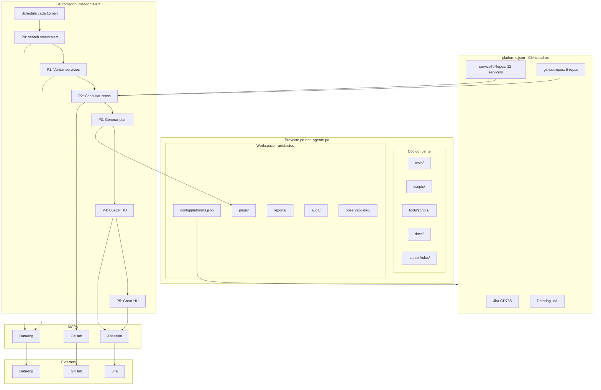

# Esquema del proyecto prueba-agente-po

> Vista general de componentes, flujos y configuraciones.

---

## Diagrama principal

> **Editar en Draw.io:** Abre [diagrams.net](https://app.diagrams.net) → Arrange → Insert → Advanced → Mermaid, y pega el contenido de [diagrams/esquema-proyecto-completo.mmd](../diagrams/esquema-proyecto-completo.mmd).

### Diagramas de análisis: Agnóstico vs Particular

| Diagrama | Descripción |
|----------|-------------|
| [Esquema funcionamiento agnóstico](./diagrams/esquema-funcionamiento-agnostico.html) | Flujos transversales: onboarding, E2E, auditoría, reportes, agentes |
| [Esquema acciones particulares](./diagrams/esquema-acciones-particulares.html) | Acciones específicas del proyecto (Ciencuadras): Automation Datadog, Jira GD768, serviceToRepos |

---

## Resumen por capa

| Capa | Componentes |
|------|-------------|
| **Código** | tests/, scripts/, tools/scripts/, docs/, .cursor/rules/ |
| **Workspace** | config/platforms.json, plans/, reports/, audit/, observabilidad/ |
| **Config** | Jira GD768, Datadog us1, serviceToRepos (12), github.repos (5) |
| **Automation** | Schedule → 6 pasos (MCP Datadog → validar → repos → plan → Jira) |
| **MCPs** | Datadog, Atlassian, GitHub |
| **Externos** | Datadog, Jira, GitHub |

---

## Flujos principales

| Flujo | Entrada | Salida |
|-------|---------|--------|
| **Automation Datadog** | Schedule + MCP Datadog `status:alert` | plan en plans/, HU en Jira |
| **Tests E2E** | platforms.json (baseURL, smokePaths) | playwright report |
| **Auditoría** | platforms.json (auditZones) | Workspace/audit/ |
| **Reportes** | jira-cycle-*.json | Workspace/reports/ → deploy:pages |

---

## Configuración actual (Ciencuadras)

| Sección | Valores |
|---------|---------|
| **Jira** | projectKey: GD768, incidentBoardId: 35754 |
| **Datadog** | site: us1, dashboardIds: wei-k9v-vkx |
| **serviceToRepos** | 12 servicios (admin-eventos-masivos-ms, carrito-compras-ms, portal-frontend, etc.) |
| **github.repos** | 5 repos (admin-eventos-masivos-ms, admin-ms, lambdas-infra, portal-frontend, carrito-compras-ms) |

---

## Referencias

- [ESTRUCTURA.md](./ESTRUCTURA.md) — Árbol de directorios
- [runbook/automation-datadog-alert.md](./runbook/automation-datadog-alert.md) — Flujo de automation
- [architecture/0-overview.md](./architecture/0-overview.md) — Visión general
