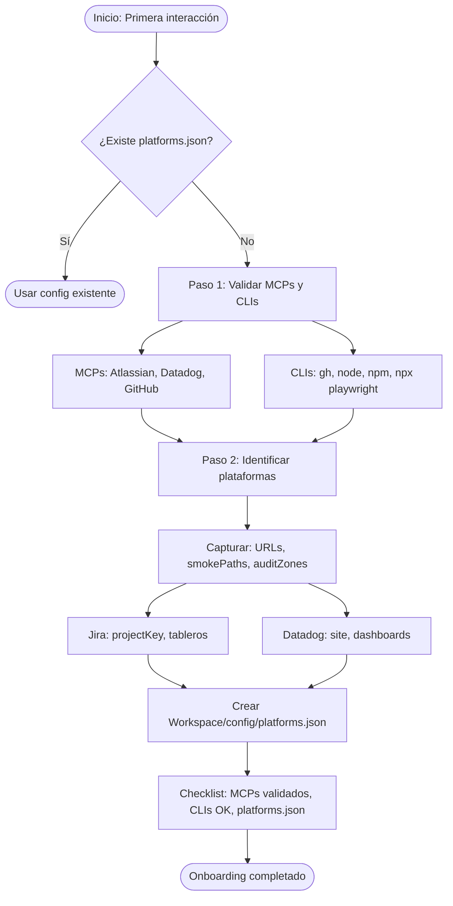

# Flujo de Primera Interacción

> Este flujo debe ejecutarse cuando el agente interactúa por primera vez con el proyecto o cuando no existe `Workspace/config/platforms.json`.

## Objetivo

Validar el entorno y capturar la configuración de plataformas para que el proyecto sea **agnóstico** y funcione con cualquier producto.

---

## Diagrama del flujo de onboarding

> **[Abrir en Draw.io](../diagrams/flujo-onboarding.html)** — Editar diagrama en la aplicación

---

## Paso 1: Validar configuración de MCPs y CLIs

### MCPs requeridos por Skills

| MCP | Uso | Validación |
|-----|-----|------------|
| **atlassian** | Jira, Confluence (tickets, backlogs, triage) | Probar `getVisibleJiraProjects` o `getAccessibleAtlassianResources` |
| **datadog** | Logs, métricas, dashboards, incidentes | Ver skill `datadog-mcp-setup`: revisar que `mcp.json` no tenga `${DD_MCP_DOMAIN}` |
| **github** | PRs, issues, `gh pr list` | Probar `list_pull_requests` o verificar que `gh` CLI esté instalado |

### MCP opcional: Playwright

| MCP | Uso | Validación |
|-----|-----|------------|
| **playwright** | Exploración interactiva de la UI, verificación ad hoc | Ver `docs/onboarding/02-playwright-mcp-config.md`. Comprobar que el servidor aparece en Cursor o probar `browser_navigate` |

Complementa al CLI `npx playwright`; no lo sustituye. Para smoke tests y CI se usa `npm test`.

### CLIs requeridos

| CLI | Uso | Comando de validación |
|-----|-----|------------------------|
| `gh` | GitHub (PRs, ramas) | `gh auth status` |
| `node` | Tests, scripts | `node --version` (18+) |
| `npm` | Dependencias, scripts | `npm --version` |
| `npx playwright` | E2E, auditoría | `npx playwright --version` |

### Acciones

1. Para **Datadog**: leer `datadog-mcp-setup` skill. Si `mcp.json` tiene `${DD_MCP_DOMAIN}`, pedir al usuario el dominio (us1, us3, us5, eu1, ap1, ap2).
2. Para **Atlassian**: intentar una llamada de prueba. Si falla, indicar que revise credenciales/OAuth.
3. Para **CLIs**: ejecutar los comandos de validación y reportar qué falta.

---

## Paso 2: Identificar plataformas a trabajar

Si no existe `Workspace/config/platforms.json`, crearlo a partir de `docs/templates/platforms.example.json` y solicitar al usuario:

### Datos a capturar por plataforma

| Dato | Descripción | Ejemplo |
|------|-------------|---------|
| **URLs** | App principal, staging, docs | `https://www.ejemplo.com` |
| **smokePaths** | Rutas para smoke tests E2E | `["/", "/arriendo", "/venta"]` |
| **auditZones** | Zonas para auditoría de consola | `[{ "name": "Home", "url": "/" }, ...]` |
| **Jira - Proyecto** | Clave del proyecto, URL | `PROJ`, `https://sitio.atlassian.net/browse/PROJ` |
| **Jira - Tablero de incidentes** | ID o URL del board | `123` |
| **Jira - Tablero de incidentes de seguridad** | ID o URL del board | `456` |
| **Datadog** | Site, IDs de dashboards relevantes | `us1`, `[12345, 67890]` |
| **GitHub - Repos** | Org y repos de la plataforma (para agente GitHub Repos) | `{ "org": "mi-org", "repos": ["frontend", "api"] }` |

### Formato de salida

El archivo `Workspace/config/platforms.json` debe seguir la estructura de la plantilla. Puede haber varias plataformas; `defaultPlatformId` indica cuál usar por defecto.

---

## Checklist de onboarding completado

- [ ] MCP Atlassian: validado
- [ ] MCP Datadog: configurado (dominio sin placeholder)
- [ ] MCP GitHub: validado
- [ ] CLI `gh`: instalado y autenticado
- [ ] CLI `node` 18+: instalado
- [ ] CLI `npx playwright`: instalado
- [ ] `Workspace/config/platforms.json` creado con al menos una plataforma
- [ ] URLs, Jira y Datadog definidos para la plataforma por defecto
- [ ] (Opcional) MCP Playwright: configurado para exploración interactiva — ver `docs/onboarding/02-playwright-mcp-config.md`

---

## Referencias

- Plantilla: `docs/templates/platforms.example.json`
- Skill Datadog: `.cursor/plugins/.../datadog-mcp-setup/SKILL.md`
- Estructura Workspace: `docs/architecture/4-workspace.md`
- Playwright MCP (opcional): `docs/onboarding/02-playwright-mcp-config.md`
